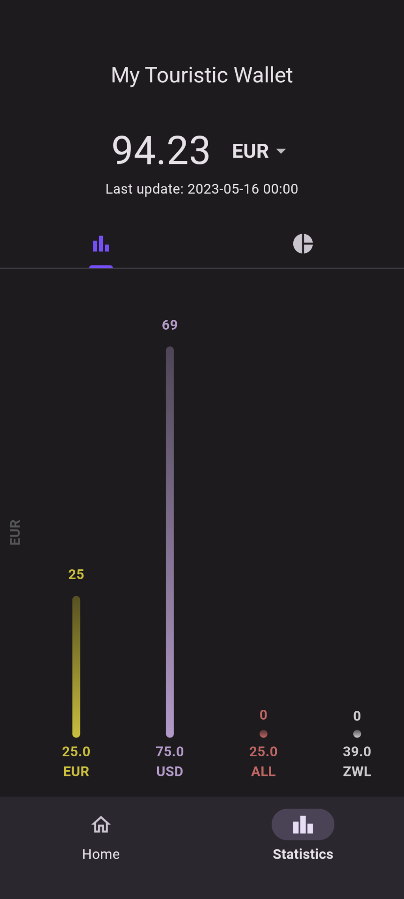
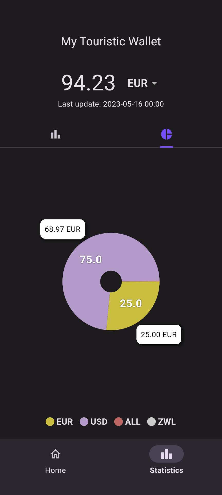
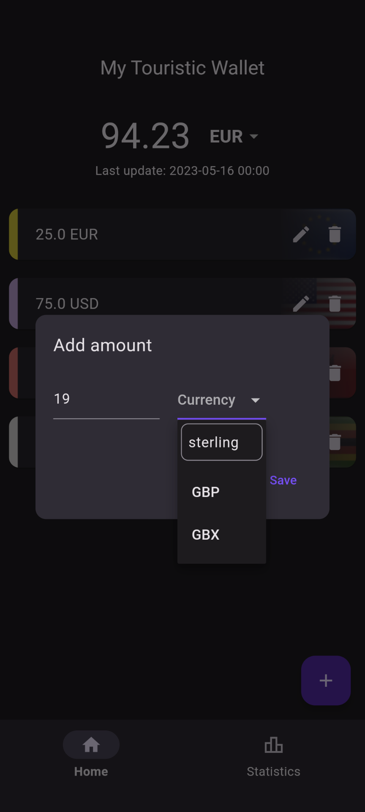

# Practical Assignment #2 - My touristic wallet in Flutter

    

By:
- Bruno Mendes [up201906166](mailto:up201906166@edu.fe.up.pt)
- Fernando Rego [up201905951](mailto:up201905951@edu.fe.up.pt)
- Gustavo Santos [up201907397](mailto:up201907397@edu.fe.up.pt)
- José Costa [up201907216](mailto:up201907216@edu.fe.up.pt)

## How to run

Start the Android application using your preferred method (we recommend sideloading with `Android Studio` with the `dart` and `flutter` plugins).

## Overview

This app is provided without the need of a backend, making use of the `CurrencyFreaks` API to get the latest currency exchange rates (API key required, you can change it  at `touristic_wallet/lib/provider/exchange_rates_provider.dart`).

Being built using the Flutter framework, it is compatible with both Android and iOS.

The app has 2 main screens: the home screen and the statistics screen.

### Home Screen

Here the user can see their current balance using a base currency and manage the amounts of each currency they have. They can also add new currencies to their wallet by tapping the floating action button. For each currency in their wallet, the user can update the amount they have by tapping the edit button or remove a currency by tapping the delete button.

Pulling down on the total balance will refresh the exchange rates and update the values accordingly.

    

### Statistics Screen

The statistics screen allows the user to visually understand how much each currency is worth in relation to the base currency. It also shows the total amount of each currency in the wallet.

|        |       |
| -------------- | -------------- |
 |  |

Two charts are available: a bar chart and a pie chart. The bar chart shows the total amount of each currency in the wallet while the pie chart shows what percentage of the wallet is made up of each currency.

The pie chart is interactive, allowing the user to hold on a currency to zoom on it.

## Main Features

### Multiple currencies

The user can add as many currencies as they want to their wallet. The app will automatically fetch the exchange rates from the API and update the balance accordingly.

To add new currencies simply tap the floating action button on the home screen, then, on the newly open dialog, input the amount to add and select the currency from the dropdown menu, then hit save. To make the currency selection easier you can also search by typing the code or currency name in the dropdown.

    

Updating the amount of a currency is done by tapping the edit button on the currency card and inputting the new amount or by just adding more of that currency. To delete a currency, simply tap the delete button on the currency card and confirm the deletion.

### Dynamic base currency

The user is not limited to a single base currency. They can change the base currency at any time by tapping the base currency card and selecting the new currency from the dropdown menu. Their balance will be updated with the amount they own of each currency in relation to the new base currency.

### Persisted data

The user's entire wallet is persisted across app restarts and device reboots. The data is stored in a local database using the `sqflite` package.

The app can also be used offline with the rates from when the user was last online.

### Currency visualization

The provided charts help the user keep track of how much each currency is worth in relation to the base currency and how much of each currency they have in their wallet.

## Additional Features

### Currency flags

Each currency is represented by its flag in the currency cards in order to make it easier for the user to identify each currency.

### Adaptive Icon

We used the `flutter_launcher_icons` package to create an adaptive icon for both iOS and Android. We also added a Themed Icon for Android manually.

### Splash Screen

We used the `flutter_native_splash` package to create a splash screen that is equal for both platforms, iOS and Android.

### Dark Mode

The app supports both light and dark mode, according to the user's system preferences.

## Performed Tests
We have tested the app thorougly with manual acceptance tests and across several devices with different Android API levels (32, 33, 34(Beta) ). 

Unfortunately, we were not able to test the app on iOS devices due to the lack of access to such devices.

This could be improved with automated unit and acceptance testing, in the future.

## References

- [Flutter documentation](https://docs.flutter.dev)
- [`sqflite` package](https://pub.dev/packages/sqflite)
- [`FL Chart` package](https://pub.dev/packages/fl_chart)
- [`Flutter DropdownButton2` package](https://pub.dev/packages/dropdown_button2)
- [`Cached network image` package](https://pub.dev/packages/cached_network_image)
- [`CurrencyFreaks` API](https://currencyfreaks.com)
- [Class Slides](https://moodle.up.pt/course/view.php?id=2244)
